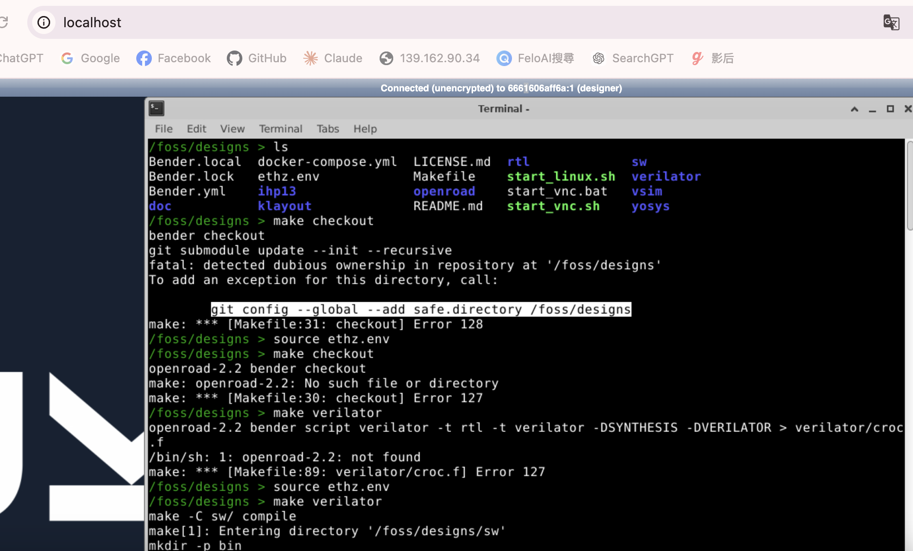

# croc

## mac 中測試

1. 先啟動 docker
2. ./start_vnc.sh
3. 進入 localhost
4. 點選左下角的 Terminal
5. 出現 Terminal，輸入 ls
6. 執行 source ethz.env
7. 執行 make checkout

結果出現



結果發現是 ethz.env 檔案的內容問題

原本是

```
export BENDER="openroad-2.2 bender"
export MORTY="openroad-2.2 morty"
export SV2V="openroad-2.2 sv2v"
export SVASE="openroad-2.2 svase"
export OPENROAD="openroad-2.2 openroad"
export YOSYS="yosys-0.35 yosys"
export PYTHON3="python3.6-3.6.5-af"
export VERILATOR="verilator-5.020 verilator"

```

於是我改成 ccc/ethz_ccc.env 如下

然後再 source 一次

    source ccc/ethz_ccc.env

接著做

```
make checkout
make pickle
make yosys
make openroad
make klayout
```

這樣就通過了

最後的檔案會放在 klayout/croc_chip.gds 當中。


