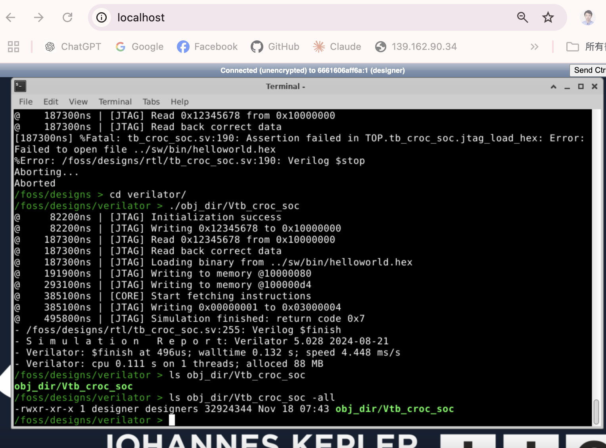

# croc -- verilator 模擬

1. 如果 verilator/ 資料夾中已經有 croc.f 檔案，先刪除之
2. 輸入 make verilator
3. 完成之後，似乎不會直接跑測試，但是 verilator/obj_dir/Vtb_croc_soc 有產生出來
    * cd verilator; ./obj_dir/Vtb_croc_soc 執行之，會看到下列畫面。

