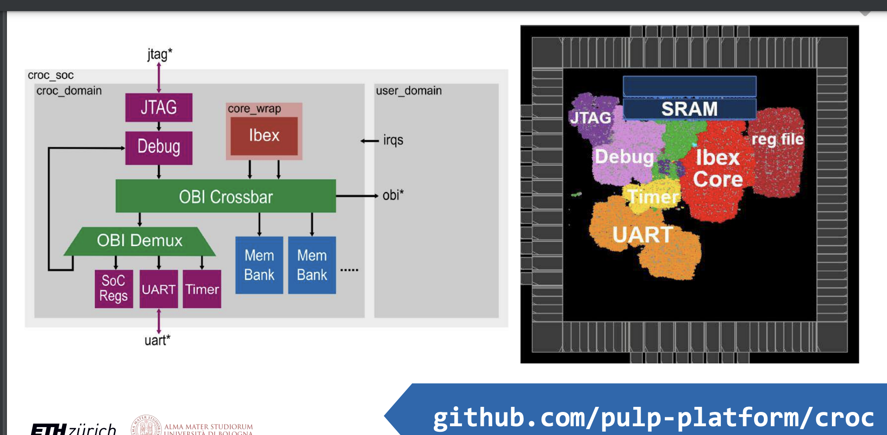

# 結語 -- 透過 CROC 理解開源 EDA 的發展

## 開源 IC 設計 EDA

在 CROC 專案中我們看到，開源 IC 設計的 EDA 已經可以串連成一整套，而且可以真正的運作並讓晶圓廠 tapeout 了，ETH Zürich 的 pulp 團隊清楚地展示了這個過程。

1. Verilator: Verification (Verilog => RTL)
2. YosisHQ: Synthesizer (RTL => Netlist)
3. OpenROAD: Place and Route (Netlist => GDS2)

## 整合與連結

但是為了要連結整個過程，於是他們又加入了下列工具

1. SystemVerilog: sv2v, morty, svase
2. 用 rust 自制 bender 工具，作為硬體領域的建置工具
    * https://github.com/pulp-platform/bender

## 晶片智財庫

CROC 的架構如下

主要使用了以下 IC 元件

1. ibex : RISC-V 處理器
    * https://github.com/open-ic/ibex
2. obi*: 輸出入介面
3. JTAG: debug 用
4. Mem Bank / SoC Regs/ UART / Timer 等元件。

然後再由 pulp 整合起來，形成 CROC 教學單晶片。

